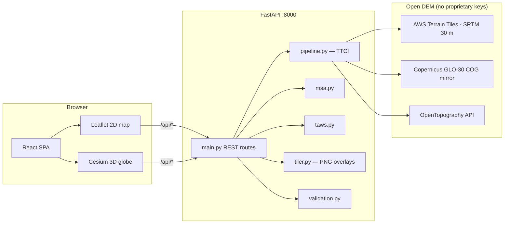
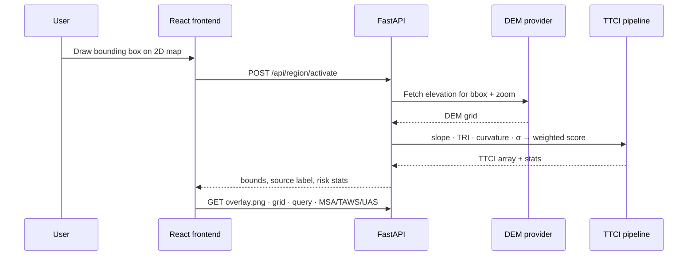

<p align="center">
  
</p>

<h1 align="center">Terrain Guard</h1>

<p align="center">
  <strong>A validated Terrain Topography Complexity Index (TTCI) for aviation safety.</strong><br/>
  Interactive 2D/3D terrain-risk assessment built for the Honeywell<br/>
  <em>Terrain Guard — Terrain Complexity Assessment Tool</em> problem statement (DP1).
</p>

<p align="center">
  
</p>

<p align="center">
  <sub>TTCI risk overlay on real SRTM terrain · point query · collapsible tool sidebar</sub>
</p>

---

## Contents

- [Overview](#overview)
- [Screenshots](#screenshots)
- [TTCI methodology](#ttci-methodology)
- [Architecture](#architecture)
- [Repository layout](#repository-layout)
- [Getting started](#getting-started)
- [Configuration](#configuration)
- [DEM data sources](#dem-data-sources)
- [CFIT validation](#cfit-validation)
- [Performance](#performance)
- [API reference](#api-reference)
- [Testing](#testing)
- [Limitations](#limitations)

---

## Overview

Controlled Flight Into Terrain (CFIT) remains a leading cause of fatal aviation accidents. Terrain databases record **elevation**; they do not provide a single, portable measure of how **complex and hazardous** the underlying topography is.

Terrain Guard:

1. **Ingests open DEM data** (SRTM, Copernicus GLO-30, or OpenTopography) for any user-selected area on Earth.
2. **Computes TTCI** — a normalized `[0, 1]` complexity score from slope, ruggedness, curvature, and local relief.
3. **Serves an interactive application** with a 2D Leaflet risk map and a 3D Cesium globe draped over exaggerated terrain relief.
4. **Runs aviation-safety tools** on top of the active TTCI surface: point query, route MSA, predictive TAWS look-ahead, and UAS corridor scoring.
5. **Validates the index** against 15 documented historical CFIT accidents using a matched case–control study.

No area is hard-coded. The user draws a region on the map; the backend computes TTCI on demand and publishes it as the active surface for every tool and overlay.

---

## Screenshots

| 2D risk map | 3D globe |
| :---: | :---: |
|  |  |
| TTCI overlay, region draw, map click query | Cesium relief with TTCI drape, route, fly simulation |

| Route (MSA) | Alerts (TAWS) | Accidents (validation) |
| :---: | :---: | :---: |
|  |  |  |
| Draw waypoints · per-sector MSA · elevation profile · 3D fly-through | Place aircraft · look-ahead profile · pull-up audio cue | 15-site CFIT study · ROC metrics · per-site heatmaps |

### Application features (implemented)

| Area | What ships today |
| --- | --- |
| **Map (2D)** | World view, draw-to-select region, TTCI overlay toggle/opacity, point click query, route/corridor/aircraft/history-pin drawing |
| **Globe (3D)** | Keyless CesiumJS, Esri World Imagery base, custom DEM relief, TTCI imagery drape, route + MSA labels, aircraft fly simulation, chase camera, reposition / fit-region controls |
| **Overview** | Active-region stats, risk bands, last map-click TTCI breakdown |
| **Route** | Multi-waypoint MSA per 25 NM sector buffer, terrain profile chart, animated 3D fly route with clearance-based audio alert |
| **Alerts** | EGPWS-style look-ahead terrain check modulated by local TTCI |
| **UAS** | Corridor waypoint scoring with per-segment TTCI risk |
| **Accidents** | Loads `validation_report.json` + global report; per-site patch heatmaps via API |
| **History** | Client-side map pins and notes (`localStorage`) |
| **Settings** | Light / dark / system theme, 2D vs 3D default view, DEM source, overlay controls, tool tab visibility, globe exaggeration |

---

## TTCI methodology

TTCI fuses four terrain metrics derived from the active DEM, each normalized to `[0, 1]` and combined with fixed weights:

| Metric | Weight | Method |
| --- | :---: | --- |
| Slope | 30% | Horn's method |
| TRI (Terrain Ruggedness Index) | 30% | Riley 1999 |
| Curvature | 20% | Zevenbergen & Thorne |
| Elevation σ | 20% | 5×5 local standard deviation |

Scores map to five contiguous risk bands:

| Range | Label | Color |
| --- | --- | --- |
| 0.0 – 0.2 | Very Low | `#2ecc71` |
| 0.2 – 0.4 | Low | `#f1c40f` |
| 0.4 – 0.6 | Moderate | `#e67e22` |
| 0.6 – 0.8 | High | `#e74c3c` |
| 0.8 – 1.0 | Critical | `#8e44ad` |

Implementation: `backend/ttci/pipeline.py`.

---

## Architecture

Two-service monorepo: a **FastAPI** computation API and a **React + Vite** single-page client. In production/demo mode the API also serves the built frontend from `frontend/dist`.



### Region activation flow



### Stack

| Layer | Technologies |
| --- | --- |
| **Backend** | Python 3.11+, FastAPI, NumPy, SciPy, Rasterio, Pillow |
| **Frontend** | React 18, TypeScript, Vite, Tailwind CSS, shadcn/ui primitives, Leaflet, CesiumJS (via `vite-plugin-cesium`) |
| **Testing** | pytest, Hypothesis (property-based) |
| **Persistence** | In-memory active surface on the server; generated rasters in `backend/data/` (gitignored); client settings/history in `localStorage` |

---

## Repository layout

```
.
├── backend/
│   ├── main.py                  # FastAPI app + static frontend mount
│   ├── benchmark.py             # TTCI throughput benchmark CLI
│   ├── validate_ttci.py         # Local CFIT validation → data/validation_report.json
│   ├── validate_ttci_global.py  # Global CFIT validation → data/validation_report_global.json
│   ├── requirements.txt
│   ├── ttci/
│   │   ├── pipeline.py          # TTCI computation
│   │   ├── downloader.py        # DEM acquisition orchestration
│   │   ├── terrain_tiles.py     # AWS Terrain Tiles (SRTM)
│   │   ├── copernicus.py        # Copernicus GLO-30
│   │   ├── geo.py               # Coordinate ↔ cell mapping
│   │   ├── msa.py               # Minimum Safe Altitude + profiles
│   │   ├── taws.py              # Predictive look-ahead alerting
│   │   ├── tiler.py             # TTCI overlay PNG rendering
│   │   ├── cfit_accidents.py    # 15 curated CFIT accident sites
│   │   └── validation.py        # Case–control validation engine
│   ├── tests/                   # 48 pytest + Hypothesis tests
│   └── data/                    # Generated overlays & validation JSON (gitignored except reports checked in)
├── frontend/
│   ├── public/
│   │   ├── models/Cesium_Air.glb
│   │   └── terrain-pullup.aac   # TAWS pull-up audio cue
│   └── src/
│       ├── App.tsx              # Shell: header · sidebar · map pane
│       ├── components/          # MapView, Globe3DView, panels, charts
│       ├── state/               # ttci.tsx (surface) · tools.tsx (interaction)
│       └── lib/                 # api.ts · globe3d.ts · theme · notifications
└── docs/images/                 # README screenshots & logo
```

---

## Getting started

### Prerequisites

- **Python 3.11+** with `pip`
- **Node.js 18+** with `npm`

### 1 · Backend

```bash
cd backend
python -m venv venv
source venv/bin/activate          # Windows: venv\Scripts\activate
pip install -r requirements.txt
uvicorn main:app --reload         # → http://127.0.0.1:8000
```

The API starts with **no preloaded region** unless `TTCI_PRELOAD=1` is set. Use **Select area** in the UI to compute TTCI for any bbox.

### 2 · Frontend (development)

```bash
cd frontend
npm install
npm run dev                       # → http://localhost:5173  (proxies /api → :8000)
```

Open **http://localhost:5173** for hot reload during development.

### 3 · Single-origin demo build

```bash
cd frontend
npm run build                     # writes frontend/dist
# With the backend still running, open http://127.0.0.1:8000
```

FastAPI serves both the API and the built SPA from one origin.

### Quick workflow

1. Open the app → click **Select area** (top-left of the 2D map) → draw a rectangle.
2. Wait for TTCI computation → colored overlay appears.
3. Click the map for a point query, or open **Route**, **Alerts**, or **UAS** in the sidebar.
4. Switch to **3D Globe** for relief + fly simulation.

---

## Configuration

Copy `backend/.env.example` to `backend/.env`, or export:

```bash
export TTCI_PRELOAD=1                      # optional: compute a region at startup
export TTCI_BBOX="33.8,34.5,76.8,77.8"   # south,north,west,east (WGS84)
export TTCI_ZOOM=11                        # tile zoom (11 ≈ 76 m/px)
export TTCI_SOURCE=tiles                   # tiles | copernicus | opentopo | auto
export TTCI_SYNTHETIC=1                    # force synthetic demo DEM (dev only)
export OPENTOPO_API_KEY=...                # required when TTCI_SOURCE=opentopo
```

Client preferences (theme, default view, DEM choice, tool visibility) persist in browser `localStorage`.

---

## DEM data sources

All three open datasets referenced in the brief are supported. The active source is shown in the app header after region activation.

| `TTCI_SOURCE` | Dataset | API key | Backend module |
| --- | --- | :---: | --- |
| `tiles` (default) | SRTM 30 m via AWS Terrain Tiles | None | `ttci/terrain_tiles.py` |
| `copernicus` | Copernicus GLO-30 (ESA public COG mirror) | None | `ttci/copernicus.py` |
| `opentopo` | OpenTopography multi-source API | Free key | `ttci/downloader.py` |
| `auto` | OpenTopography if key set, else Terrain Tiles | — | `ttci/downloader.py` |

If real terrain cannot be fetched, the API returns an error for user-selected regions (no silent substitution). A labelled synthetic DEM exists for offline development via `TTCI_SYNTHETIC=1`.

---

## CFIT validation

Terrain Guard validates TTCI against **15 curated CFIT accidents** (`ttci/cfit_accidents.py`) using a matched case–control design: crash-site TTCI is compared to thousands of random control cells drawn from each site's surrounding terrain patch, with real DEM fetches at zoom 11.

Generate or refresh reports:

```bash
cd backend
python validate_ttci.py          # → data/validation_report.json
python validate_ttci_global.py   # → data/validation_report_global.json
```

Results from the checked-in local report (`n_controls = 6000`):

| Measure | Crash sites | Surrounding controls |
| --- | :---: | :---: |
| Mean TTCI | **0.43** | 0.26 (1.66× lift) |
| Share in High/Critical (≥ 0.6) | **40%** | 11% |
| Mean TTCI within 1 km neighbourhood | **0.91** | 0.57 |
| High/Critical within 1 km | **100%** | — |

| Statistic | Value |
| --- | :---: |
| ROC AUC (exact crash cell) | 0.68 |
| Mann–Whitney *p* (exact cell) | 0.007 |
| ROC AUC (≤ 1 km neighbourhood) | **0.80** |
| Mann–Whitney *p* (≤ 1 km) | 3.4 × 10⁻⁵ |
| Mean site percentile vs. local terrain | 66th |

Per-metric AUC (slope, TRI, curvature, elevation σ): 0.63–0.69. The **Accidents** tab loads these reports and renders per-site TTCI heatmaps.

> **Caveat:** Correlation, not causation. Terrain complexity is one CFIT factor among weather, procedures, and human factors. The dataset is modest and curated; results are reported with this limitation.

---

## Performance

```bash
cd backend
python benchmark.py
```

On commodity laptop hardware the TTCI pipeline sustains roughly **5.5 million cells/second** (~**12 ms** per 256×256 tile, ~85 tiles/s single-core), sufficient for on-demand regional computation in the UI.

---

## API reference

| Method | Path | Purpose |
| --- | --- | --- |
| `GET` | `/api/health` | Service readiness |
| `GET` | `/api/info` | Active surface bounds, stats, risk levels, DEM source |
| `POST` | `/api/region/activate` | Compute TTCI for a bbox → active surface |
| `GET` | `/api/region/overlay.png` | TTCI overlay for an arbitrary bbox |
| `GET` | `/api/region/info` | Stats/source for an arbitrary bbox |
| `GET` | `/api/region/grid` | Downsampled TTCI + elevation grids (3D relief) |
| `GET` | `/api/ttci/overlay.png` | Banded overlay of the active surface |
| `GET` | `/api/ttci/metadata` | Active-surface metadata |
| `GET` | `/api/ttci/query` | TTCI + terrain detail at a coordinate |
| `POST` | `/api/msa/calculate` | Per-sector MSA for a route |
| `POST` | `/api/msa/profile` | Terrain elevation profile along a route |
| `POST` | `/api/taws/check` | Point terrain-proximity check |
| `POST` | `/api/taws/lookahead` | Predictive look-ahead terrain alerting |
| `POST` | `/api/uas/corridor` | UAS corridor TTCI risk scoring |
| `GET` | `/api/validation` | Local CFIT validation report |
| `GET` | `/api/validation/global` | Global CFIT validation report |
| `GET` | `/api/validation/patch-metrics` | Per-site TTCI heatmap data (Accidents tab) |

Interactive OpenAPI docs: **http://127.0.0.1:8000/docs** when the backend is running.

---

## Testing

```bash
cd backend
pytest
```

**48 tests** cover the TTCI pipeline (unit range, no-data handling, risk classification, weight validation), geo round-trip, MSA calculator, overlay renderer, and validation statistics (including Hypothesis property tests).

```bash
cd frontend
npm run build    # TypeScript check + production bundle
```

---

## Limitations

- **Not certified avionics.** `/api/taws/lookahead` demonstrates predictive look-ahead alerting modulated by TTCI; it is not a certified TAWS/EGPWS and omits flight-phase logic and obstacle databases.
- **In-memory server state.** One active TTCI surface at a time; restarting the backend clears it unless preloaded.
- **No accounts or cloud sync.** History pins and notes live in browser `localStorage` only.
- **3D globe licensing.** CesiumJS (Apache-2.0) loads locally via `vite-plugin-cesium` with no Cesium ion token; base imagery is Esri World Imagery; relief is built from the project's own DEM grid.
- **Validation scope.** Fifteen documented CFIT accidents, case–control design, reported with statistical caveats above.

---

<p align="center">
  <sub>Honeywell Hackathon · Terrain Guard · TTCI from open DEM data</sub>
</p>
