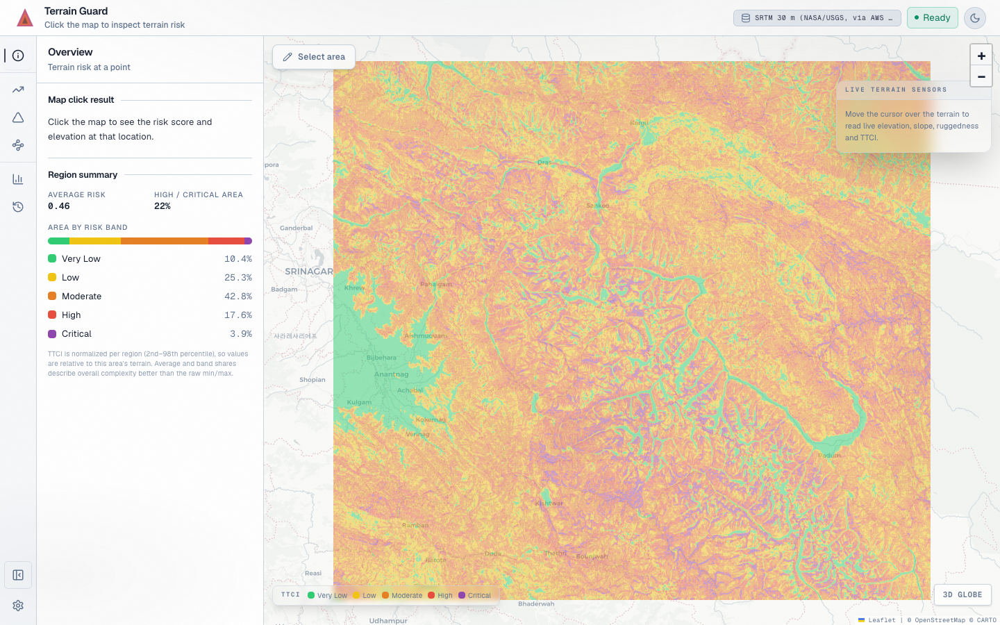
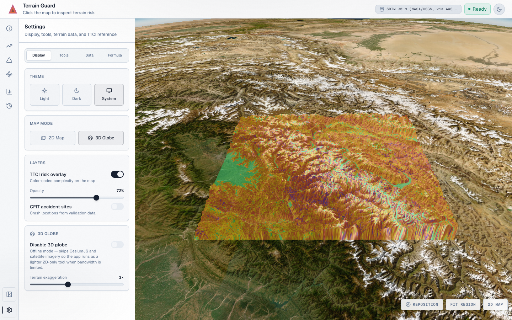
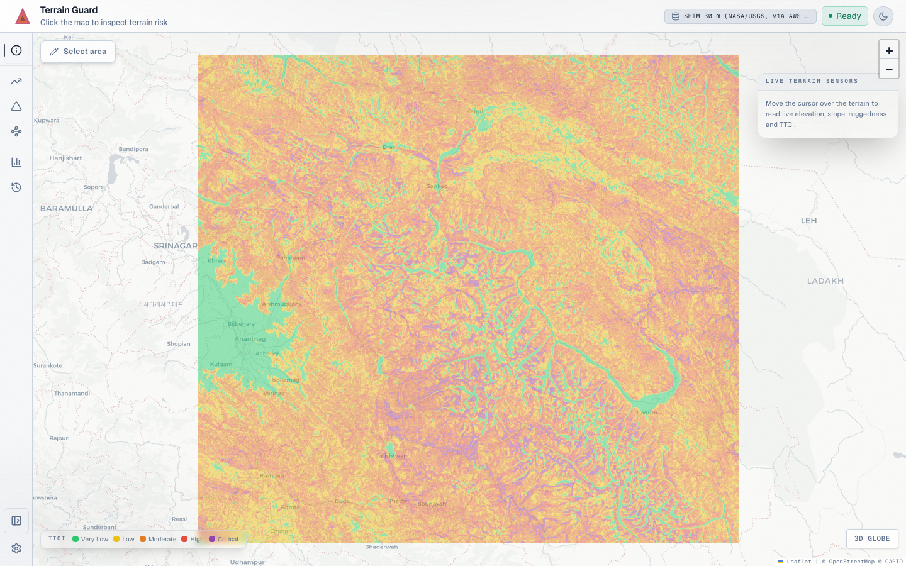
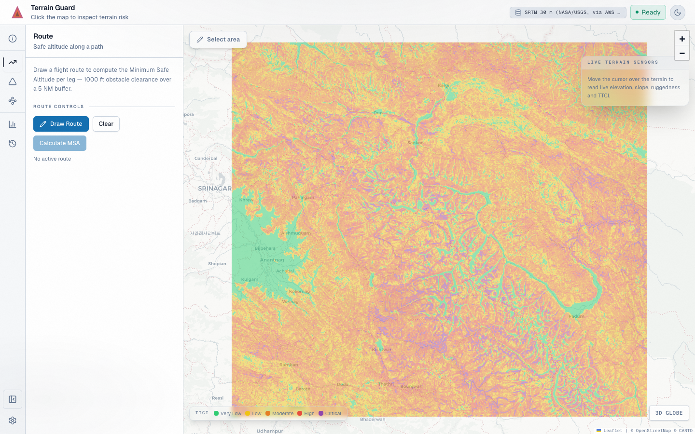
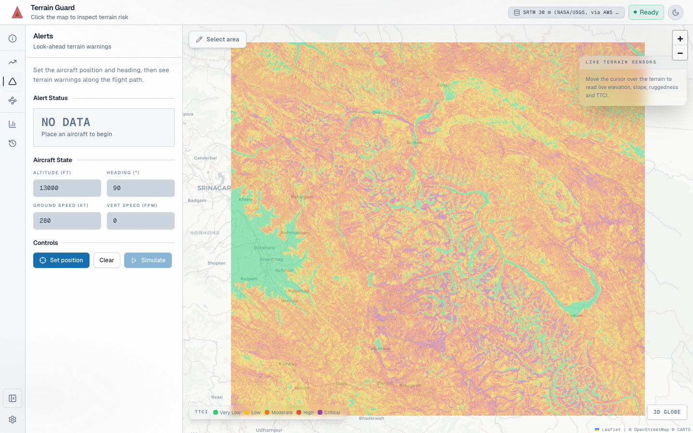
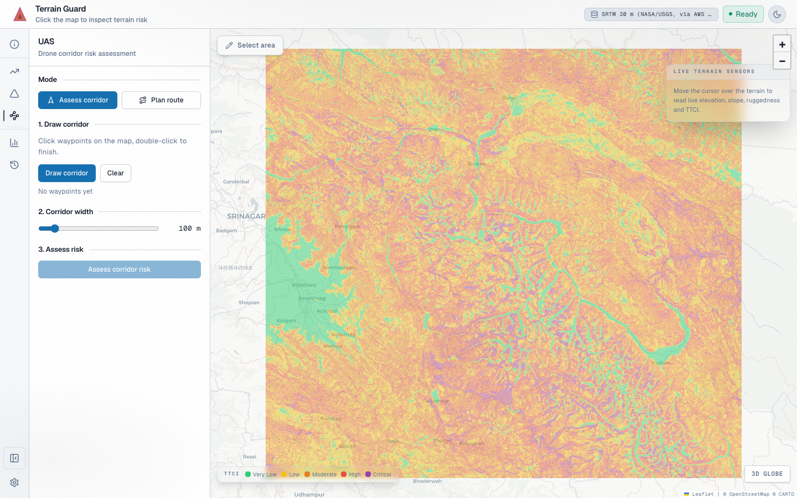
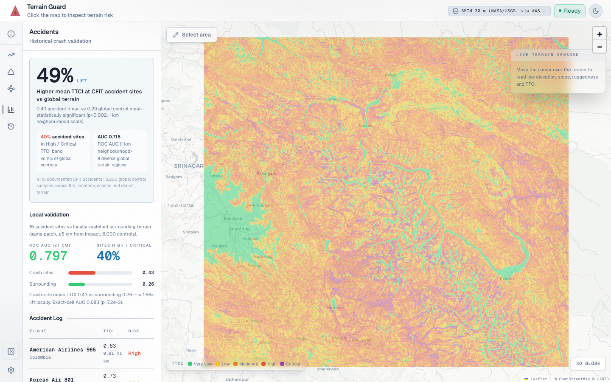
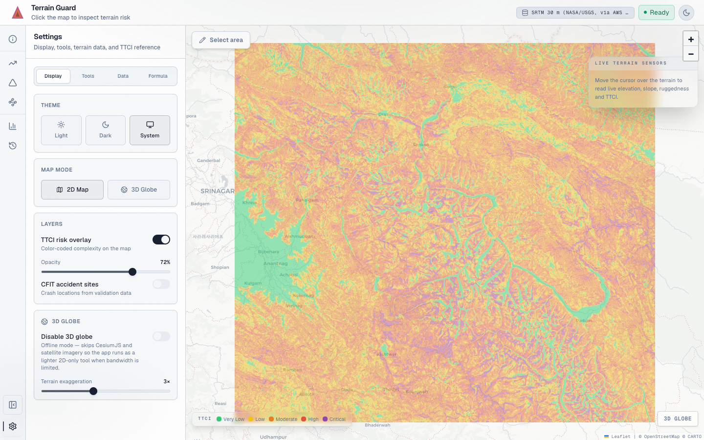
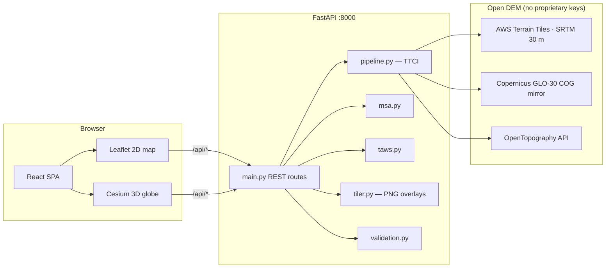
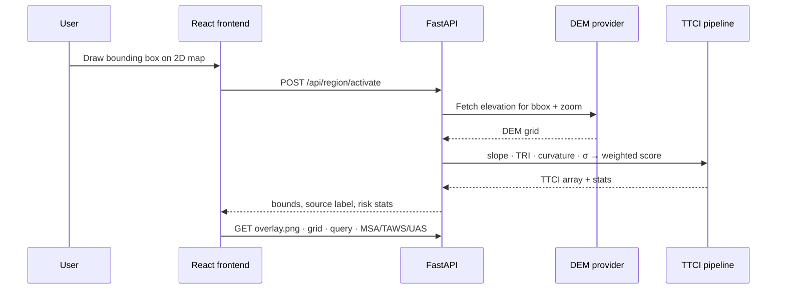

<p align="center">
  
</p>

<h1 align="center">Terrain Guard</h1>

<p align="center">
  <strong>A validated Terrain Topography Complexity Index (TTCI) for aviation safety.</strong><br/>
  Interactive 2D/3D terrain-risk assessment for routes, alerts, and UAS planning.
</p>

<p align="center">
  <em>Team Mayday · Honeywell DP1</em>
</p>

<p align="center">
  
</p>

---

## Overview

Controlled Flight Into Terrain (CFIT) remains one of the leading causes of fatal aviation accidents. Standard terrain databases record **elevation**; they do not quantify how **complex and hazardous** the topography is for flight operations.

Terrain Guard addresses this gap by computing **TTCI** — a normalized `[0, 1]` terrain-complexity score derived from open digital elevation models — and exposing it through an interactive analyst workstation. Draw any region on Earth and receive a live TTCI surface, risk bands, and operational tooling without pre-configured study areas.

The application couples a **Leaflet** 2D map with a **CesiumJS** 3D globe, route minimum safe altitude (MSA), TAWS-style look-ahead alerting, UAS corridor scoring and path planning, and CFIT validation against 15 curated historical accidents.

---

## Capabilities

| Area | What it delivers |
| --- | --- |
| **TTCI engine** | On-demand composite index from slope, TRI, curvature, and elevation variability |
| **2D map** | Draw-to-activate regions, TTCI heatmap, point queries, world bounds |
| **3D globe** | Terrain mesh, TTCI grid, chase camera, region fit and reposition |
| **Route MSA** | Great-circle segments with terrain clearance along the path |
| **TAWS look-ahead** | Forward terrain alerting along a heading and altitude |
| **UAS planning** | Corridor risk scoring and A* route planning over TTCI |
| **CFIT validation** | Case–control study vs. 15 historical accidents with ROC metrics |
| **API** | REST endpoints for region activation, queries, and all tools |

---

## Application views

### Map and globe

| 2D terrain map | 3D Cesium globe |
| :---: | :---: |
|  |  |

*Left: TTCI heatmap over open terrain tiles. Right: 3D terrain with TTCI grid and region framing.*

### Sidebar panels

| Overview | Route MSA | TAWS alerts |
| :---: | :---: | :---: |
|  |  |  |

| UAS planning | CFIT validation | Settings |
| :---: | :---: | :---: |
|  |  |  |

---

## Architecture

Terrain Guard is a monorepo: a **React** single-page application talks to a **FastAPI** backend that owns TTCI computation, tiling, and validation. In production the API serves the built frontend from a single origin.



### Region activation flow



| Layer | Technologies |
| --- | --- |
| **Frontend** | React, TypeScript, Vite, Leaflet, CesiumJS, Tailwind |
| **Backend** | FastAPI, NumPy, SciPy, Rasterio, GDAL |
| **Data** | AWS Terrain Tiles (default), Copernicus GLO-30, OpenTopography |
| **Deploy** | Docker multi-stage build, Render blueprint (`render.yaml`) |

---

## TTCI methodology

TTCI combines four geomorphometric metrics into a weighted composite, then normalizes to `[0, 1]`:

| Metric | Weight | Method |
| --- | :---: | --- |
| Slope | 30% | Horn's method |
| Terrain Ruggedness Index (TRI) | 30% | Riley et al., 1999 |
| Curvature | 20% | Zevenbergen & Thorne |
| Elevation variability | 20% | 5×5 local standard deviation |

Scores map to five risk bands: **Very Low**, **Low**, **Moderate**, **High**, and **Critical**.

Core implementation: `backend/ttci/pipeline.py`.

### DEM sources

| Source | Resolution | Notes |
| --- | --- | --- |
| AWS Terrain Tiles | ~30 m (SRTM) | Default (`TTCI_SOURCE=tiles`), no API key |
| Copernicus GLO-30 | 30 m | Public COG mirror |
| OpenTopography | Varies | Requires `OPENTOPO_API_KEY` |

---

## Getting started

**Prerequisites:** Python 3.11+, Node.js 18+, Make (macOS/Linux)

```bash
git clone https://github.com/chxmq/terrainguard.git
cd terrainguard
make
```

This installs dependencies and starts the API on **:8000** and the Vite dev server on **:5173**.

Open **http://127.0.0.1:5173**, click **Select area**, draw a bounding box on the map, and explore the sidebar tools.

### Makefile commands

| Command | Description |
| --- | --- |
| `make` | Install deps and run dev servers (API + Vite) |
| `make demo` | Production build served from a single URL on :8000 |
| `make demo-preload` | Demo with Ladakh region preloaded |
| `make test` | Run backend pytest suite |
| `make validate` | Regenerate CFIT validation report |
| `make docker-run` | Build and run the production Docker image locally |

### Manual setup

```bash
# Backend
cd backend
python -m venv .venv && source .venv/bin/activate
pip install -r requirements.txt
uvicorn main:app --reload

# Frontend (separate terminal)
cd frontend
npm install
npm run dev
```

### Configuration

Copy `backend/.env.example` to `backend/.env` and adjust as needed:

```bash
TTCI_PRELOAD=1
TTCI_BBOX=33.8,34.5,76.8,77.8    # south,north,west,east
TTCI_ZOOM=11
TTCI_SOURCE=tiles                 # tiles | copernicus | opentopo
OPENTOPO_API_KEY=...              # required only for opentopo
```

---

## Validation

TTCI is validated against **15 curated CFIT accidents** using a case–control design with real DEM at zoom 11. Control sites are sampled near each crash location under matched terrain constraints.

| Metric | Crash sites | Controls |
| --- | :---: | :---: |
| Mean TTCI | **0.43** | 0.26 |
| Median TTCI | **0.41** | 0.24 |
| ROC AUC (≤ 1 km) | **0.80** | — |

Full statistics are available in the app **Accidents** tab and in `backend/data/validation_report.json`. Regenerate with `make validate`.

---

## Deployment

Build and run locally:

```bash
make docker-run
```

[`render.yaml`](render.yaml) defines a Render.com web service from the root `Dockerfile`. Health check: `GET /api/health`.

---

## API reference

| Method | Path | Purpose |
| --- | --- | --- |
| `POST` | `/api/region/activate` | Compute TTCI for a bounding box |
| `GET` | `/api/ttci/query` | Point TTCI query |
| `POST` | `/api/msa/calculate` | Route minimum safe altitude |
| `POST` | `/api/taws/lookahead` | TAWS-style look-ahead alerting |
| `POST` | `/api/uas/corridor` | UAS corridor risk scoring |
| `POST` | `/api/uas/plan-route` | A* UAS path planning |
| `GET` | `/api/validation` | CFIT validation report |
| `GET` | `/api/health` | Health check |

Interactive OpenAPI docs: **http://127.0.0.1:8000/docs**

---

## Repository layout

```
backend/            FastAPI application and ttci/ computation package
frontend/           React SPA (MapView, Globe3DView, tool panels)
docs/images/        README screenshots and logo
Dockerfile          Multi-stage production image
render.yaml         Render deployment blueprint
Makefile            Development, demo, test, and Docker targets
```

---

<p align="center">
  <strong>Team Mayday</strong><br/>
  <sub>Terrain Guard · TTCI from open DEM data</sub>
</p>
